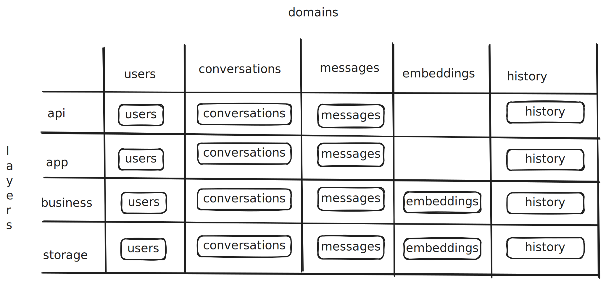

# gus
Prototype chatbot service simulating a production-ready backend for interacting with LLMs like LLaMA. Focuses on session handling, context management, and scalable API integration with Domain-Driven, Data-Oriented Architecture principles. Built using Go, ideal for experimenting with real-world chatbot architecture.

# 🧠 Managing Conversations with an LLM

When users interact with an LLM (e.g., via chat), the system must manage state, enforce rules, and optimize performance — all while delivering relevant and secure responses. Below is an explanation of what needs to be tracked and some common features to implement.

---

## 🔄 What Needs to Be Tracked Per Conversation

| Item                    | Description                                                                 |
|-------------------------|-----------------------------------------------------------------------------|
| **User ID**             | Identify and associate requests with an authenticated user.                |
| **Conversation ID**     | Group related messages to maintain context.                                 |
| **Message History**     | Store both user and LLM messages to preserve continuity across turns.       |
| **Parent Message ID**   | Track thread-like structures, useful for branching and follow-ups.          |
| **Timestamps**          | Record when messages were sent and received.                                |
| **Role**                | Identify if the message is from the user, system, or assistant (LLM).       |
| **Model Usage Stats**   | Track token count, latency, and model cost for each message.                |
| **Conversation State**  | Manage ongoing session state, e.g., active/inactive, paused, archived.      |

---

## 🔧 Key Features to Implement in the Codebase

### ✅ 1. Validate User Input
- Check for empty messages, input length, forbidden content, or unsupported prompts.
- Sanitize input to protect against injection attacks (especially with system prompts).

### 🧑‍💼 2. Validate User Roles & Access Control
- Restrict certain users from accessing premium models or features.
- Enforce role-based limitations (e.g., admin vs regular user vs guest).
- Check subscription status or usage quota.

### 🧠 3. Maintain Conversation Context
- Fetch and append previous messages in order before sending to the LLM.
- Trim old messages if the token limit is reached (using sliding windows or summarization).

### 🧮 4. Track LLM Response Time & Cost
- Measure how long the model takes to respond (`startTime → endTime`).
- Estimate or calculate token usage to bill or rate-limit users.
- Keep a running total per user/session/day/month.

### 🧱 5. Enforce Rate Limits & Quotas
- Prevent overuse by setting message limits (per minute/hour/day).
- Use the tracked usage to throttle or deny requests accordingly.
- Implement soft limits (warn users) and hard limits (block requests).

### 💾 6. Persist Conversation History
- Store messages in a database (e.g., PostgreSQL) under a structured schema.
- Support search, filtering, or retrieval of past conversations.
- Index data for analytics or summarization.

### 📉 7. Monitor for Abnormal Behavior
- Flag repeated or abusive requests.
- Detect automated behavior (bot usage).
- Analyze user patterns for misuse or errors.

### 🔍 8. Logging & Analytics
- Log request/response payloads (with privacy controls).
- Track errors, latency, and model performance metrics.
- Enable tracing per conversation for debugging or audits.

### 📥 9. System Prompts and Control Messages
- Inject system-level instructions (e.g., "Answer in JSON format").
- Dynamically alter behavior per user, session, or endpoint.

### 🧵 10. Support for Threading or Forked Conversations
- Allow users to branch off from a previous message.
- Maintain a graph/tree of message relationships (e.g., parent/child IDs).

---

## ✅ Best Practices

- Use clear boundaries between **API**, **App**, **Business**, and **Storage** layers.
- Keep domain logic (e.g., user permissions, LLM limits) in the **business layer**.
- Use background workers for slow or expensive operations (e.g., logging, billing).
- Store enough metadata to reconstruct context without reprocessing entire conversations.

## Domain Driven Design

The above is a high-level overview of the software design. Each layer and domain is separated by clear boundaries, forming a grid-like structure. Every cell in this grid represents a specific responsibility, strictly limited to the domain it belongs to.

This structure helps maintain a clear mental model of the codebase and provides a well-defined view of how layers and domains should interact. It also makes it easier to detect code smells and enforce separation of concerns.

## 📘 Domain-Driven Design (DDD) – Summary

**Domain-Driven Design** is a software development approach focused on modeling software based on the core business domain. It emphasizes collaboration between technical and domain experts to create a shared understanding and structure the system around the business’s real-world processes and rules.

---

### ✅ Key Benefits of DDD

- **Aligns code with business logic**  
  Structures the application around real-world concepts, making it easier to understand and evolve.

- **Improves communication**  
  Encourages a *shared language* (ubiquitous language) between developers and domain experts.

- **Encourages modularity**  
  Promotes the use of *bounded contexts*, allowing complex systems to be broken into manageable, decoupled parts.

- **Enhances maintainability**  
  Well-defined models reduce technical debt and make changes safer and more predictable.

- **Facilitates scaling**  
  Modular domains make it easier to scale teams, services, and infrastructure independently.

### 🧱 Code Layering Breakdown
Here’s a breakdown of what each layer should handle within this grid-based domain-driven architecture:

#### 📡 API Layer (Interface)

* Defines public-facing HTTP/GraphQL/WebSocket endpoints.
* Parses and validates incoming requests.
* Translates domain responses into HTTP responses or errors.
* Avoids containing business logic.

#### ⚙️ App Layer (Application Coordination)

* Orchestrates use cases and workflows across domains.
* Manages authorization, transactions, and context propagation.
* Coordinates service calls, message queues, or async jobs.
* Acts as a bridge between API and domain logic.

#### 🧠 Business Layer (Domain Logic)

* Encapsulates the core rules, policies, and behaviors of the system.
* Owns entities, value objects, and aggregates.
* Remains independent of infrastructure and frameworks.
* Highly testable and focused on correctness.

#### 💾 Storage Layer (Persistence)

* Implements interfaces defined by the domain (e.g., repositories).
* Maps domain models to database records (using SQL or ORM).
* Manages data access, caching, and external service calls.
* Should be replaceable without affecting business logic.